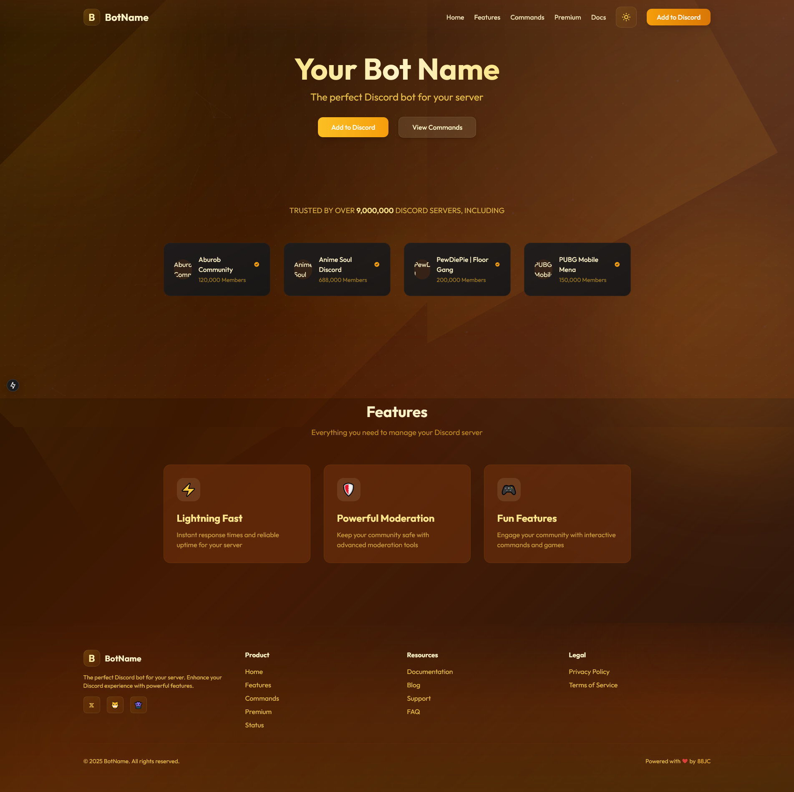

# Discord bots website template

A modern and responsive landing page for Discord bots built with Next.js 14, TypeScript, and Tailwind CSS.


## Preview



## Getting Started

First, run the development server:

```bash
npm run dev
# or
yarn dev
# or
pnpm dev
```

Open [http://localhost:3000](http://localhost:3000) with your browser to see the result.

## Project Structure

```
├── src/
│   ├── app/           # App router pages
│   ├── components/    # React components
│   ├── data/         # JSON data files
│   ├── styles/       # Global styles
│   └── types/        # TypeScript types
├── public/           # Static files
├── next.config.ts    # Next.js configuration
└── tailwind.config.ts # Tailwind CSS configuration
```

## Built With

- [Next.js 14](https://nextjs.org/) - React framework
- [TypeScript](https://www.typescriptlang.org/) - Type safety
- [Tailwind CSS](https://tailwindcss.com/) - Styling
- [Framer Motion](https://www.framer.com/motion/) - Animations

## 🤝 Contributing

Contributions, issues and feature requests are welcome!

1. Fork the repository and create a new branch for your feature or bug fix.
2. Write clean and concise code that follows the established coding style.
3. Create detailed and thorough documentation for any new features or changes.
4. Write and run tests for your code.
5. Submit a pull request with your changes. Your contribution will be reviewed by the project maintainers, and any necessary feedback or changes will be discussed with you. We appreciate your help in making Discord Bot Website better!

## 📧 Authors

- GitHub: [@88JC](https://github.com/88JC)
- Website: [88JC](https://jecky.id)
- X: [@METALHEAD666](https://x.com/METALHEAD666)
- Discord: [Cafeydo Town](https://discord.gg/CDD223E3W3)
- Discord Bot Music: [Soulvibe](https://soulvibebot.com)


## 📄 License

This project is licensed under the MIT License - see the [LICENSE](LICENSE) file for details.